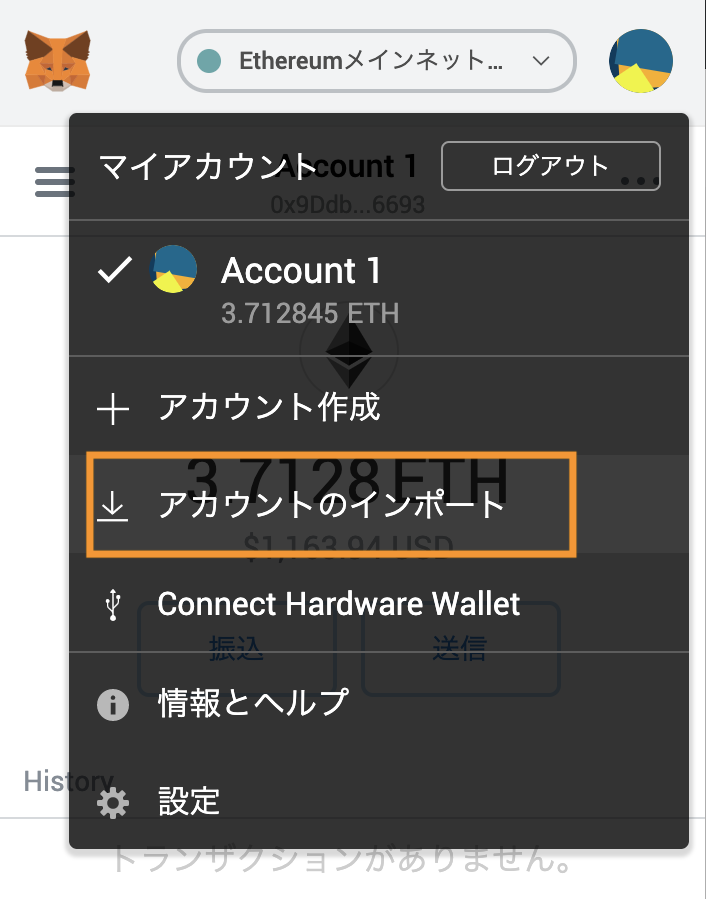
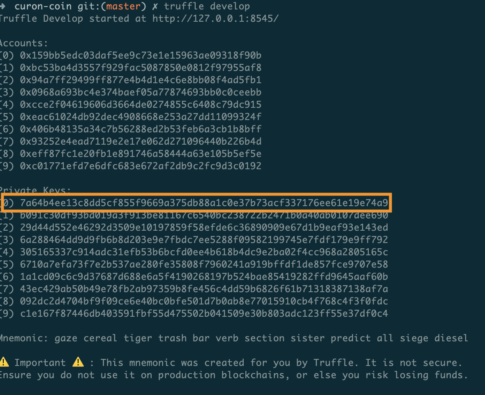
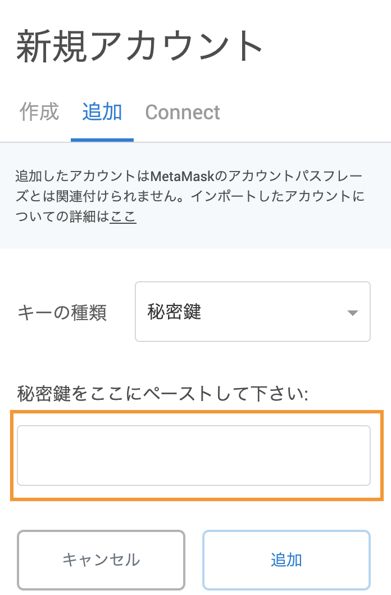
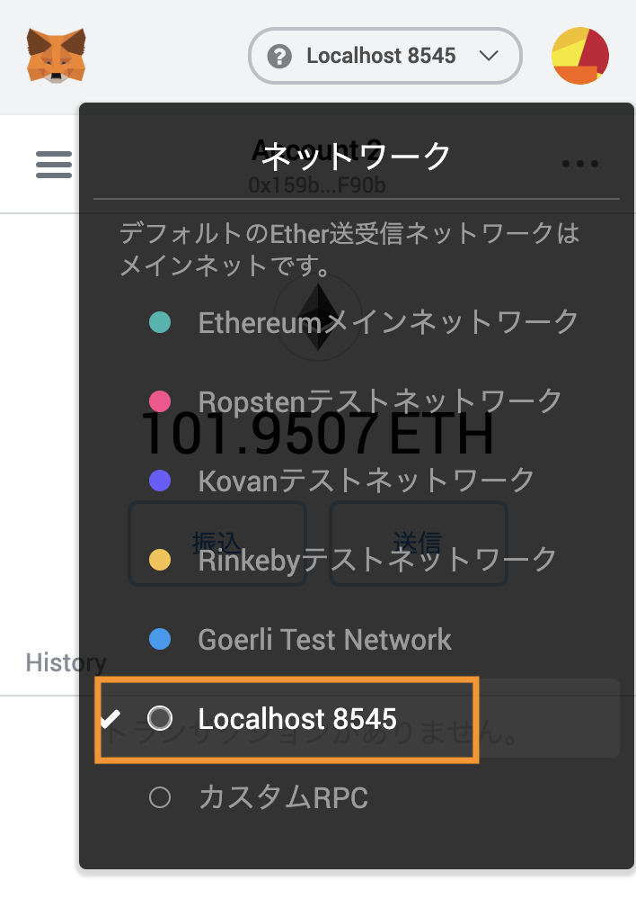

# curon-coin
crypto currency for クロンちゃん

## Settings
### Install
you need to install -g truffle. 
```
npm install -g truffle
```

### Import Address
1: you can get addresses by ruuning this command.
```
truffle develop
```
2: open chrome browser and metamask wallet addon.
(need to install metamask https://chrome.google.com/webstore/detail/metamask/nkbihfbeogaeaoehlefnkodbefgpgknn?hl=ja)

3: choose import accounts tab.


4: copy accounts[0] private address (your coinbase address).


5: paste private address to input form.


6: change network to localhost 8545.


## Referenses
#### Setting up for ganecha client address to metamask wallet.
https://tech.drecom.co.jp/go_to_the_dapps_world/

#### Learn about contract call and send method.
https://web3js.readthedocs.io/en/1.0/web3-eth-contract.html#methods-mymethod-call
https://web3js.readthedocs.io/en/1.0/web3-eth-contract.html#methods-mymethod-send

#### My ETH😀
https://etherscan.io/address/0x9Ddb22480BD6F3D56de73457Fe657520D5da6693