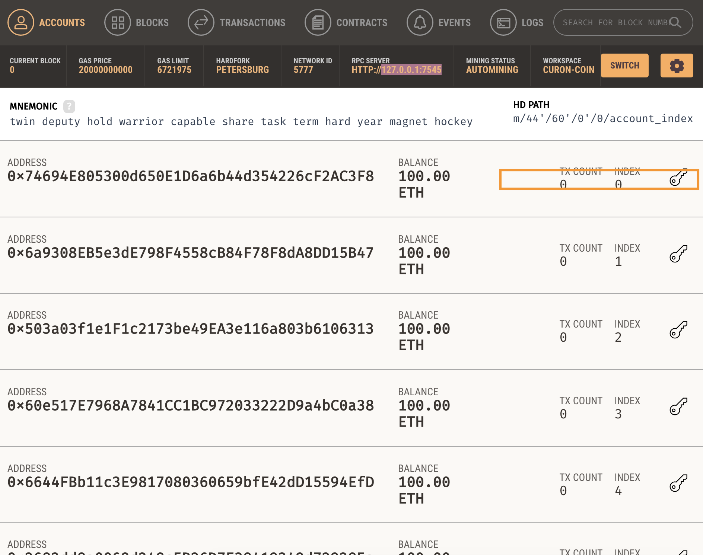
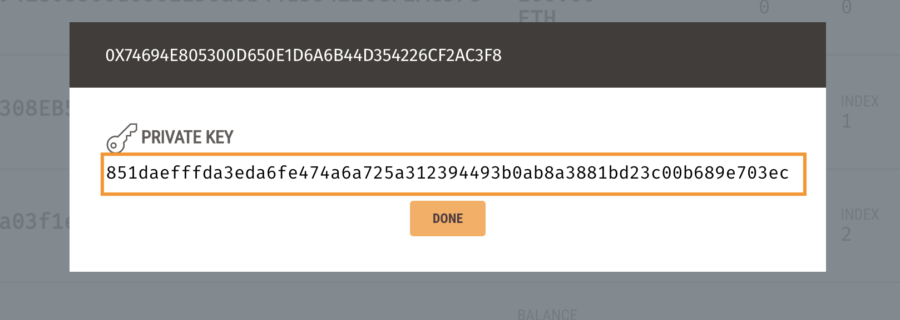
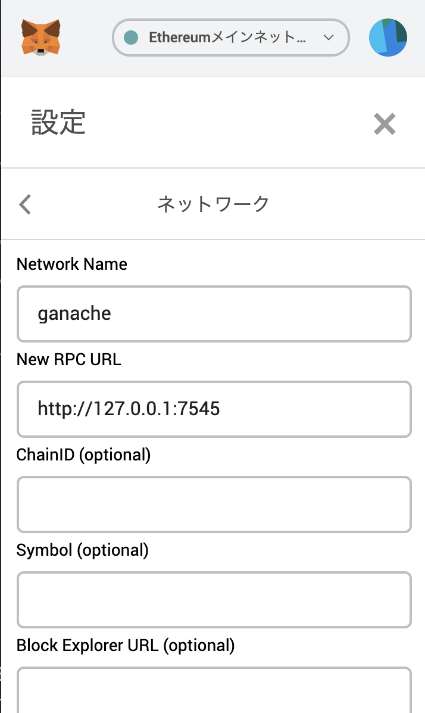

# curon-coin
crypto currency for クロンちゃん

## Settings
### Install
#### Install Truffle
```
npm install -g truffle
```

#### Install Gnache
https://www.trufflesuite.com/ganache


### Import Address
#### 1: open chrome browser and metamask wallet addon.
install metamask
https://chrome.google.com/webstore/detail/metamask/nkbihfbeogaeaoehlefnkodbefgpgknn?hl=ja

#### 2: choose import accounts tab.


#### 3: copy accounts[0] private key (your coinbase address).



#### 4: paste private key to input form.


#### 5: change network to custom localhost 7545.


### Truffle
#### Compile contract
```
truffle compile
```
#### Migrate to blockchain
```
truffle migrate
```

### Run server 
```
cd client
yarn
yarn start
```

## Referenses
#### Setting up for Ganache client, address to metamask wallet.
https://tech.drecom.co.jp/go_to_the_dapps_world/

#### Learn about contract call and send method.
https://web3js.readthedocs.io/en/1.0/web3-eth-contract.html#methods-mymethod-call
https://web3js.readthedocs.io/en/1.0/web3-eth-contract.html#methods-mymethod-send

#### My ETH😀
https://etherscan.io/address/0x9Ddb22480BD6F3D56de73457Fe657520D5da6693